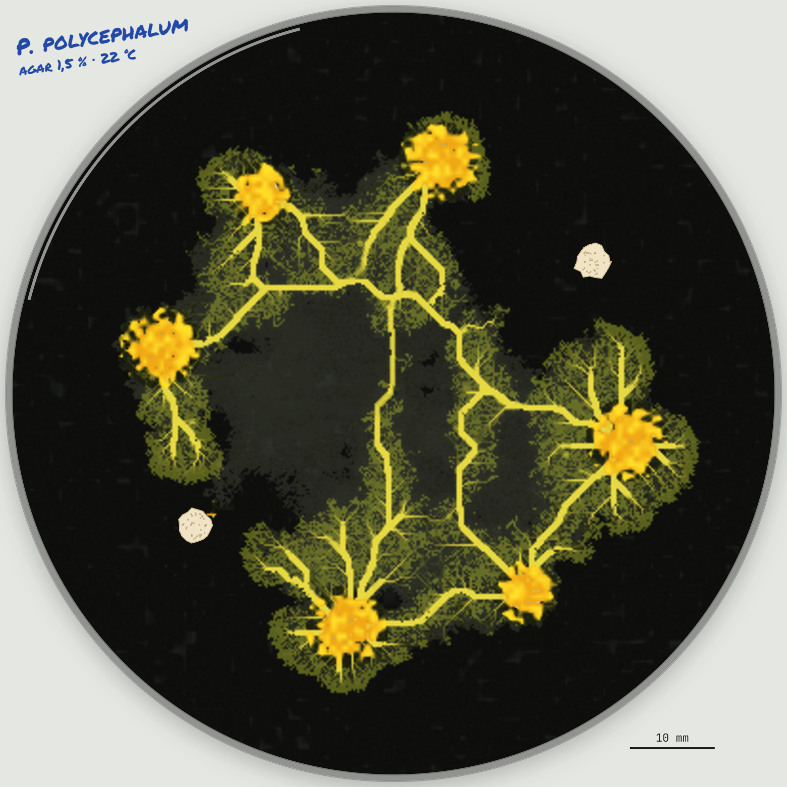
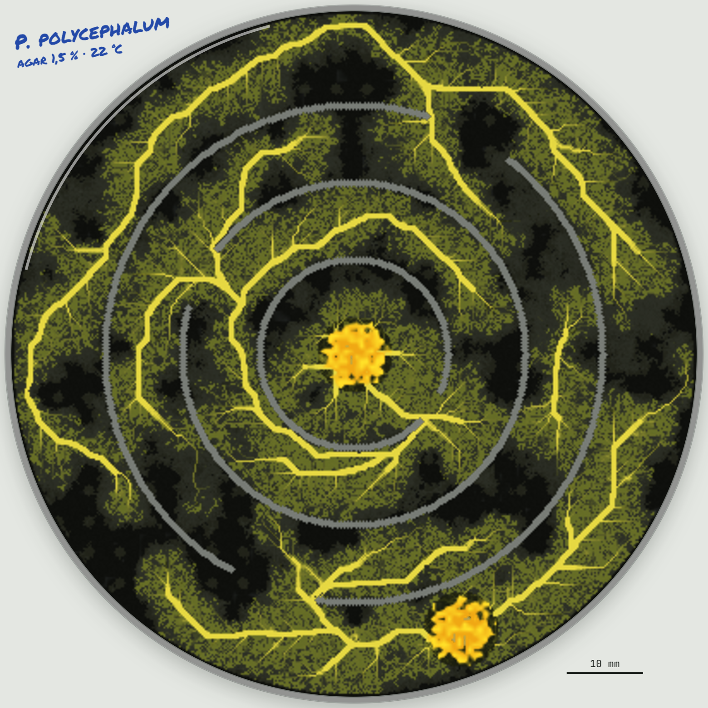
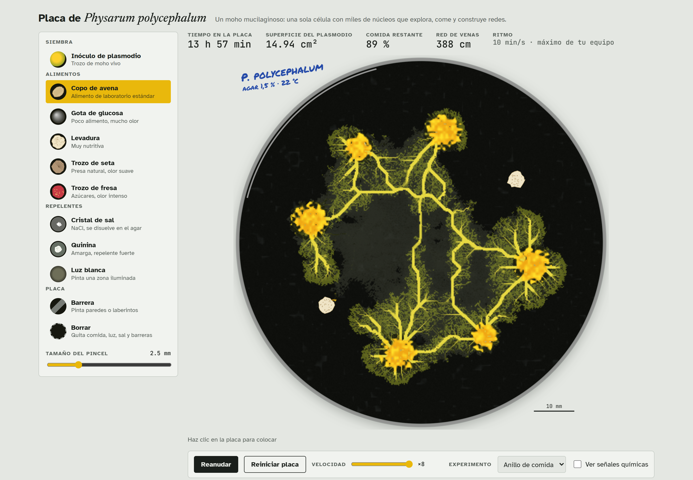

# Physarum polycephalum

By **Albert Lujan**.

An interactive, biologically grounded simulation of the slime mould *Physarum polycephalum* growing in a
90 mm Petri dish. Drop oat flakes, glucose or yeast on the agar, add salt, light or barriers, and watch a
single multinucleate cell explore the dish, engulf the food and build an adaptive vein network.

**Live: [physarum.js.org](https://physarum.js.org)** · no build step, no dependencies, runs in the browser.



## What it models

| Behaviour | In the simulation |
| --- | --- |
| Foraging front | Young cytoplasm at the edge advances as a lobed, fan-shaped sheet, in every direction, even without food nearby |
| Chemotaxis | Food releases an attractant that diffuses through the agar; once the mould covers a source, the signal is suppressed, so it can share itself between several sources |
| Adaptive veins | Cytoplasm is routed from sources (food, inoculum) to the fronts and between sources; routes that carry flow thicken into veins and unused ones fade, after the flux-reinforcement idea of Tero et al. |
| Network loops | Random local routes every few steps build a reticulated mesh with loops rather than a single tree |
| Feeding and hunger | Food is consumed, energy is shared across the whole connected plasmodium, growth costs energy and fragments cut off from food starve |
| Engulfing | While nutrient remains, a thick wrinkled mass covers the food; it thins slowly once the food is gone |
| Migration | With no food left, the rear withdraws and the plasmodium moves on, leaving slime behind |
| Slime memory | Withdrawn sheet leaves extracellular slime; the mould avoids regrowing over it unless it is well fed or smells food ([Reid et al., 2012](https://doi.org/10.1073/pnas.1215037109)) |
| Repellents | Salt and quinine dissolve into the agar. Bright light: paint a lit area and the photophobic plasmodium will not grow into it, pulls back from it and pays extra upkeep while inside |

Scale: a 400 × 400 lattice over a 90 mm dish (0.23 mm per cell). One step is 40 s, calibrated so the front
advances at roughly 1 cm/h, as a real plasmodium does.

| Maze scenario | Growing network |
| --- | --- |
|  |  |

## What it is not

A teaching and exploration toy, not a validated scientific model. Nutrient and scent values are relative and
ranked from lab practice, not measured. Veins are noisy least-cost routes, not a hydraulic solution of the
Hagen–Poiseuille network equations, so the dish does not guarantee shortest-path solutions in a maze. There
is no rhythmic shuttle streaming and no sporulation.

Inspired by the agent model of [Jones (2010)](https://doi.org/10.1162/artl.2010.16.2.16202), the adaptive
network model of [Tero et al. (2010)](https://doi.org/10.1126/science.1177894) and the maze experiments of
[Nakagaki et al. (2000)](https://doi.org/10.1038/35035159).

## Run it locally

```sh
python -m http.server 8765   # or any static server; ES modules need http, not file://
```

Then open <http://localhost:8765/>.

```sh
npm test         # 32 behaviour tests, no dependencies (node --test)
npm run snapshot -- ring out.bin 300,900,1800   # offline morphology frames
npm run profile  # per-phase cost of one simulation step
```

## Code map

| File | Role |
| --- | --- |
| `src/simulation.js` | Ties world, plasmodium and environment together; tool placement and statistics |
| `src/plasmodium.js` | Growth, retraction, metabolism, engulfing and the vein network update |
| `src/network.js` | Connected components, bucket-queue shortest-path trees and flow accumulation |
| `src/environment.js` | Attractant and repellent diffusion, slime decay |
| `src/world.js` | Lattice layers of the dish, food, repellents, light and barriers |
| `src/renderer.js`, `src/sprites.js` | Darkfield-photograph rendering of the dish and its contents |
| `src/params.js` | Every model parameter, grouped by process |
| `src/app.js` | Interface: tools, presets, playback and readouts |

## Deploying your own copy

1. Push this repository to GitHub and enable **Settings → Pages → Deploy from branch → `main` / root**.
2. The site is then served at `https://<user>.github.io/<repo>/`.
3. For the custom domain, keep the `CNAME` file and request the subdomain at
   [js-org/js.org](https://github.com/js-org/js.org) (a pull request adding `"physarum": "<user>.github.io"`).

## Licence

[MIT](LICENSE) © Albert Lujan.
